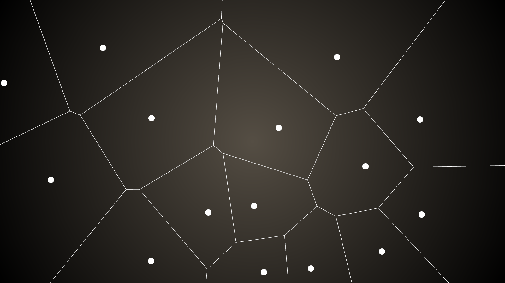

ofxVoronoi2D
============

OpenFramework addon to use the 2D Voronoi implementation of Shane O Sullivans



Usage
-----
Simply put:
  1. Create
  2. Computation from the seed points
  3. Cell usage
  4. Mesh usage

```cpp
// 1. Instance
ofxVoronoi2D voronoi;
vector<ofVec2f> pts;
// init pts
// ...

// 2. Voronoi computation
voronoi.compute(pts, ofRectangle(0, 0, ofGetWidth(), ofGetHeight()));

// 3. Edge drawing
for(ofxSegmentIterator it = voronoi.edges(); it; ++it){
  ofxSegment s = *it;
  ofLine(s.p1, s.p2);
}

// 4. Mesh usage
ofMesh mesh;
voronoi.buildMesh(mesh);
mesh.setColorForIndices(0, mesh.getNumIndices(), ofFloatColor(1.0f, 1.0f, 1.0f));
for(unsigned int i = 0; i < mesh.getNumIndices(); i += 3)
  mesh.setColor(mesh.getIndex(i), ofFloatColor(0l0f, 0.0f, 1.0f)); // cell center
}
mesh.draw();
```

See also the interactive example applications in `example-simple/` and `example-withUI/`.

TODO
----
  - optionally compute boundary faces for voronoi cells
  - faster minDist computation (here brute-force = O(n²)
  - smarter point usage to avoid having to go through the points to split into xPts and yPts (or fix in original code)

License
-------
Released under the [MIT License](http://www.opensource.org/licenses/MIT).
